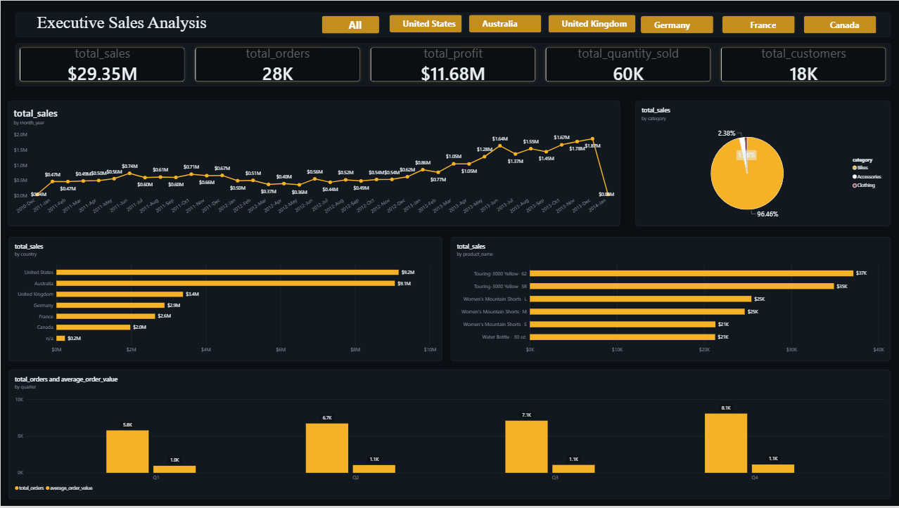
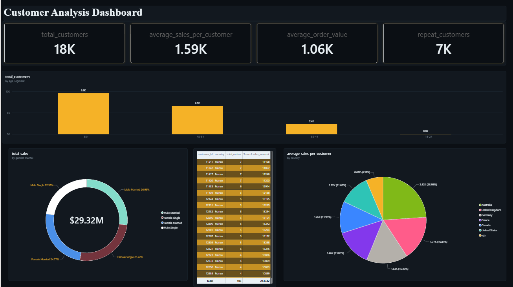
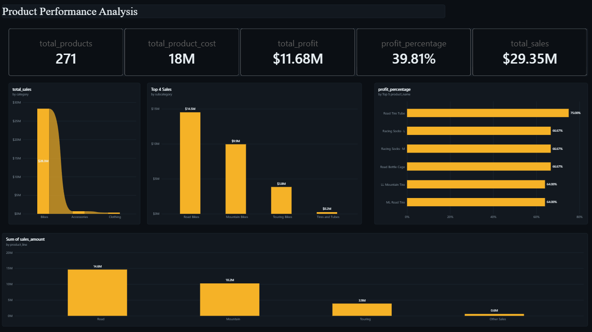

# Adventure Works Sales Analytics Dashboard

## 📖 Project Overview

This project presents a comprehensive Sales Analytics Solution built using SQL Server, Power BI, Power Query, and DAX. The solution transforms raw sales data into actionable business insights through interactive dashboards focused on executive performance, customer behavior, and product profitability.

The project follows a complete analytics workflow:

- Data Warehousing using SQL Server
- Data Exploration and Business Analysis using SQL
- Data Modeling using a Star Schema
- Data Transformation using Power Query
- KPI Development using DAX
- Interactive Dashboard Development using Power BI

---

## 📑 Table of Contents

- [Project Overview](#-project-overview)
- [Business Problem](#-business-problem)
- [Project Roadmap](#project-roadmap)
- [Technology Stack](#-technology-stack)
- [Project Structure](#-project-structure)
- [Data Model](#-data-model)
- [SQL Analytics Implementation](#-sql-analytics-implementation)
- [Dashboard Pages](#-dashboard-pages)
- [Key DAX Measures](#-key-dax-measures)
- [Business Value Delivered](#-business-value-delivered)
- [Skills Demonstrated](#-skills-demonstrated)
- [Author](#-author)

---

## 🎯 Business Problem

Organizations generate large volumes of transactional sales data but often lack a centralized analytics solution to answer critical business questions such as:

- How are sales performing over time?
- Which products generate the highest revenue and profit?
- Which customer segments drive business growth?
- What countries contribute most to revenue?
- Which product lines are most profitable?
- What is the overall business profitability?

---

## Project Roadmap


---

## Technology Stack

| Technology | Purpose |
|------------|----------|
| SQL Server | Data Warehouse & Analytics |
| T-SQL | Data Exploration & Reporting |
| Power Query | Data Cleaning & Transformation |
| Power BI | Dashboard Development |
| DAX | KPI Calculations |
| GitHub | Version Control & Portfolio |

---

## 📂 Project Structure

```text
SQL_Data_Analytics_Project/
│
├── PowerBI/
│   └── dashboards/
│       ├── SALES_DASHBOARD.pbix
│       ├── customer_analysis_dashboard.pbix
│       ├── executive_sales_analysis.png
│       ├── product_performance_analysis.png
│       └── placeholder
│
├── datasets/
│   └── raw_data/
│       ├── DataWarehouseAnalytics.bak
│       ├── dim_customers.csv
│       ├── dim_products.csv
│       ├── fact_sales.csv
│       └── placeholder
│
├── docs/
│   └── project_roadmap.png
│
├── scripts/
│   ├── 00_init_database.sql
│   ├── 01_database_exploration.sql
│   ├── 02_dimensions_exploration.sql
│   ├── 03_date_range_exploration.sql
│   ├── 04_measures_exploration.sql
│   ├── 05_magnitude_analysis.sql
│   ├── 06_ranking_analysis.sql
│   ├── 07_change_over_time_analysis.sql
│   ├── 08_cumulative_analysis.sql
│   ├── 09_performance_analysis.sql
│   ├── 10_data_segmentation.sql
│   ├── 11_part_to_whole_analysis.sql
│   ├── 12_report_customers.sql
│   └── 13_report_products.sql
│
├── LICENSE
└── README.md
```

---

## ⭐ Data Model

The project uses a dimensional model following data warehousing best practices.

### Fact Table

- fact_sales

### Dimension Tables

- dim_customers
- dim_products

### Model Type

- Star Schema

---

## 📊 SQL Analytics Implementation

The SQL layer consists of multiple analytical modules:

| Script | Purpose |
|----------|----------|
| 01_database_exploration.sql | Database exploration |
| 02_dimensions_exploration.sql | Customer & Product analysis |
| 03_date_range_exploration.sql | Date analysis |
| 04_measures_exploration.sql | KPI calculations |
| 05_magnitude_analysis.sql | Sales magnitude analysis |
| 06_ranking_analysis.sql | Ranking insights |
| 07_change_over_time_analysis.sql | Trend analysis |
| 08_cumulative_analysis.sql | Running totals |
| 09_performance_analysis.sql | Product performance |
| 10_data_segmentation.sql | Customer segmentation |
| 11_part_to_whole_analysis.sql | Contribution analysis |
| 12_report_customers.sql | Customer reports |
| 13_report_products.sql | Product reports |

---

# 📈 Dashboard Pages

## 1️⃣ Executive Sales Analysis



### Key KPIs

- Total Sales: $29.35M
- Total Orders: 28K
- Total Quantity Sold: 60K
- Total Profit: $11.68M
- Total Customers:18K

### Analysis Included

- Monthly Sales Trend
- Total Sales By Category
- Total Orders And Average Order Value by Quarter
- Total Sales By Country
- Total Sales By Country

---

## 2️⃣ Customer Analysis Dashboard



### Key KPIs

- Total Customers: 18K
- Average Sales Per Customer: 1.59K
- Average Order Value: $1.06K
- Repeat Customers: 7K
### Analysis Included

- Total Customers By Age Segment
- Total Sales By Gender Marital
- Top 10 Customers By Sales
- Average Sales Per Customer By Country
  

---

## 3️⃣ Product Performance Analysis



### Key KPIs

- Total Products: 271
- Profit: $11.68M
- Profit Margin: 39.81%
- Total Sales: $29.35M

### Analysis Included

- Category Performance
- Profit Percentage of Top 5 Products
- Total Sales By Product Line
- Top 4 Sales By Product Category

---

## 📐 Key DAX Measures

```DAX
Total Sales =
SUM(fact_sales[sales_amount])
```

```DAX
Total Orders =
DISTINCTCOUNT(fact_sales[order_number])
```

```DAX
Average Order Value =
DIVIDE([Total Sales],[Total Orders])
```

```DAX
Profit =
[Total Sales] - [Total Product Cost]
```

```DAX
Profit Margin % =
DIVIDE([Profit],[Total Sales])
```

---

## 💡 Business Value Delivered

This solution enables stakeholders to:

- Monitor business performance through KPIs
- Identify top-performing products
- Analyze customer purchasing patterns
- Track profitability across categories
- Evaluate regional sales performance
- Support strategic decision-making with data-driven insights

---

## 🚀 Skills Demonstrated

- SQL Server
- T-SQL
- Data Warehousing
- Data Modeling
- Power Query
- DAX
- Power BI
- Dashboard Design
- Customer Analytics
- Product Analytics
- Business Intelligence
- Git & GitHub

---

## Author

**Kiran**

Aspiring Data Analyst | SQL | Power BI | Excel | Data Visualization

GitHub: https://github.com/kiran5814

LinkedIn: Add your LinkedIn profile URL here
